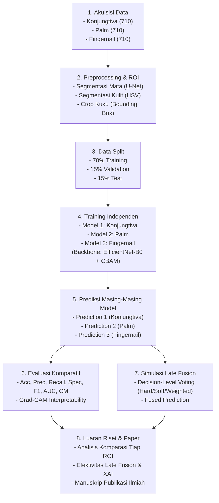

# Non-Invasive Anemia Screening via Multi-Modality Deep Learning

> **Analisis Komparatif Model Deep Learning Berbasis EfficientNet-B0 + CBAM untuk Skrining Anemia Non-Invasif pada Tiga Modalitas Citra Anatomi (Konjungtiva, Telapak Tangan, dan Kuku)**

Proyek riset deep learning untuk deteksi/skrining risiko anemia non-invasif berbasis citra medis dari 3 modalitas anatomi (*unpaired dataset*), dilengkapi modul atensi **CBAM (Convolutional Block Attention Module)**, *explainable AI* (**Grad-CAM**), simulasi **Late Fusion (Decision-Level Voting)**, dan luaran akhir berupa artikel ilmiah/paper.

---

## 🏛️ Pipeline Arsitektur Riset (Berdasarkan `docs/pipeline.png`)



---

## 📁 Struktur Folder Proyek

```text
Anemia_KonjungtivaMata/
├── docs/                               # Dokumentasi riset & acuan
│   ├── planning.md                     # Deskripsi topik, research gap, urgency, dataset
│   └── pipeline.png                    # Diagram alur pipeline riset
│
├── data/                               # Manajemen dataset
│   ├── raw/                            # Data citra mentah dari sumber asli
│   │   ├── cp_anemic/                  # CP-AnemiC (710 citra konjungtiva anak)
│   │   ├── eyes_defy_anemia/           # Eyes-defy-anemia (218 citra cross-domain)
│   │   ├── palm/                       # Palpable Palm Ghana (710 citra telapak tangan)
│   │   └── fingernail/                 # Fingernail Colour Ghana (710 citra kuku)
│   ├── processed/                      # Hasil preprocessing & ekstraksi ROI
│   │   ├── conjunctiva/                # Citra konjungtiva hasil segmentasi U-Net
│   │   ├── palm/                       # Citra telapak tangan hasil segmentasi HSV
│   │   └── fingernail/                 # Citra kuku hasil crop bounding box
│   └── splits/                         # File partisi dataset (70% train, 15% val, 15% test)
│       ├── conjunctiva_splits.csv
│       ├── palm_splits.csv
│       └── fingernail_splits.csv
│
├── src/                                # Source code modular (Python Package)
│   ├── __init__.py
│   ├── config.py                       # Konfigurasi global (seed, path, hyperparameter)
│   ├── data/                           # Dataset loader & augmentasi
│   │   ├── __init__.py
│   │   ├── dataset.py                  # PyTorch Dataset per modalitas
│   │   └── transforms.py               # Data augmentation & normalisasi
│   ├── preprocessing/                  # Ekstraksi ROI per modalitas (Pipeline Tahap 2)
│   │   ├── __init__.py
│   │   ├── eye_segmentation.py         # U-Net inferensi / segmentasi konjungtiva
│   │   ├── palm_segmentation.py        # HSV color space skin segmentation
│   │   └── nail_cropper.py             # Bounding box detection & cropping kuku
│   ├── models/                         # Arsitektur Deep Learning (Pipeline Tahap 4)
│   │   ├── __init__.py
│   │   ├── cbam.py                     # Channel & Spatial Attention Module
│   │   ├── unet.py                     # Arsitektur U-Net untuk segmentasi mata
│   │   ├── efficientnet_cbam.py        # Backbone EfficientNet-B0 + CBAM (<6M params)
│   │   └── model_factory.py            # Instansiasi & pemuatan bobot model
│   ├── training/                       # Engine pelatihan model
│   │   ├── __init__.py
│   │   ├── trainer.py                  # Training loop, validasi, early stopping
│   │   ├── losses.py                   # Loss function (CrossEntropy / Focal Loss)
│   │   └── scheduler.py                # Learning rate schedulers
│   ├── evaluation/                     # Evaluasi & XAI (Pipeline Tahap 6)
│   │   ├── __init__.py
│   │   ├── metrics.py                  # Akurasi, Presisi, Recall, Spesifisitas, F1, AUC
│   │   ├── gradcam.py                  # Visualisasi peta panas Grad-CAM
│   │   └── comparator.py               # Perbandingan komparatif apple-to-apple antar modalitas
│   ├── fusion/                         # Fusi multi-modalitas (Pipeline Tahap 7)
│   │   ├── __init__.py
│   │   └── late_fusion.py              # Decision-level voting (Hard/Soft/Weighted voting)
│   └── utils/                          # Helper & utilities
│       ├── __init__.py
│       ├── logger.py                   # Logging sistem & eksperimen
│       ├── visualization.py            # Plot kurva latih, ROC curve, confusion matrix
│       └── seed.py                     # Reproducibility handler
│
├── scripts/                            # Skrip eksekusi bertahap
│   ├── 1_prepare_splits.py             # Generate pembagian 70/15/15 secara stratified
│   ├── 2_run_preprocessing.py          # Eksekusi segmentasi ROI untuk 3 modalitas
│   ├── 3_train_models.py               # Latih model konjungtiva, palm, dan fingernail
│   ├── 4_evaluate_models.py            # Hitung metrik lengkap & generate Grad-CAM
│   └── 5_run_late_fusion.py            # Simulasi late fusion dan agregasi keputusan
│
├── checkpoints/                        # Model weights (.pt / .pth)
│   ├── conjunctiva/                    # Bobot terbaik model konjungtiva
│   ├── palm/                           # Bobot terbaik model telapak tangan
│   ├── fingernail/                     # Bobot terbaik model kuku
│   └── unet/                           # Bobot U-Net segmentasi konjungtiva
│
├── results/                            # Luaran eksperimen untuk analisis & paper
│   ├── figures/                        # Grafik visualisasi
│   │   ├── curves/                     # Loss & accuracy curves, ROC curves
│   │   ├── confusion_matrices/         # Matriks konfusi per modalitas & fusi
│   │   └── gradcam/                    # Peta atensi visual Grad-CAM
│   ├── tables/                         # Tabel komparasi metrik (CSV & LaTeX)
│   └── logs/                           # Log file histori pelatihan
│
├── paper/                              # Material penyusunan manuskrip paper ilmiah
│   ├── sections/                       # Draf bab paper (Intro, Method, Results, Discussion)
│   ├── figures/                        # Gambar final siap cetak untuk paper
│   └── tables/                         # Tabel komparatif hasil eksperimen untuk paper
│
├── notebooks/                          # Jupyter Notebooks untuk EDA & eksplorasi visual
├── requirements.txt                    # Dependensi pustaka Python
└── README.md                           # Dokumentasi proyek
```

---

## 🎯 Fokus Teknis Riset

1. **Lightweight & Efficient**: Arsitektur **EfficientNet-B0 + CBAM** dirancang memiliki parameter di bawah 6 juta (<20 MB) dan latensi inferensi ramah perangkat mobile (<300 ms).
2. **Standardized Comparison**: Evaluasi adil (*apple-to-apple*) dengan backbone dan hyperparameter terstandarisasi untuk 3 region anatomi (mata, telapak tangan, kuku).
3. **Medically Explainable**: Visualisasi Grad-CAM untuk memverifikasi model fokus pada jaringan vaskular pucat (*pallor*), bukan derau latar belakang.
4. **Handling Unpaired Data**: Pelatihan independen per modalitas dilanjutkan dengan simulasi *late fusion (decision-level voting)*.
