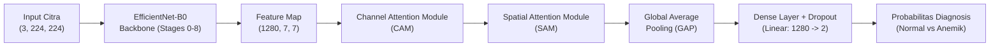

# 3. Metodologi Penelitian

## 3.1 Akuisisi dan Karakterisasi Dataset
Penelitian ini menggunakan dataset citra konjungtiva mata publik **Eyes-defy-anemia** (Maglietta et al., 2022) yang mencakup **218 subjek** dewasa dari dua kohort etnis berbeda:
1. **Kohort Italia**: 123 subjek (usia 20–88 tahun, rerata $49.3 \pm 18.2$ tahun; 83 laki-laki, 40 perempuan).
2. **Kohort India**: 95 subjek (usia 19–75 tahun, rerata $33.7 \pm 11.4$ tahun; 49 laki-laki, 46 perempuan).

Setiap subjek dilengkapi data klinis laboratorium berupa kadar Hemoglobin darah ($Hgb$, g/dL). Berdasarkan standar klinis World Health Organization (WHO) untuk populasi dewasa ($\ge 15$ tahun), label biner anemia didefinisikan sebagai berikut:

$$\text{Anemia} = \begin{cases} 1 \ (\text{Anemik}), & \text{jika } (\text{Gender} = \text{M} \land Hb < 13.0 \text{ g/dL}) \lor (\text{Gender} = \text{F} \land Hb < 12.0 \text{ g/dL}) \\ 0 \ (\text{Normal}), & \text{lainnya} \end{cases}$$

Distribusi kelas menghasilkan 126 subjek Normal (58.1%) dan 91 subjek Anemik (41.9%), dengan 1 data dikecualikan akibat ketiadaan catatan laboratorium.

## 3.2 Partisi Data Terstratifikasi (*Stratified Splitting*)
Untuk mencegah bias etnis dan ketidakseimbangan kelas antar subset evaluasi, pembagian dataset dilakukan secara terstratifikasi (*joint stratification*) berbasis gabungan variabel etnis dan status anemia ke dalam proporsi:
- **70% Training Set** (151 sampel: 88 Normal, 63 Anemik)
- **15% Validation Set** (33 sampel: 19 Normal, 14 Anemik)
- **15% Independent Test Set** (33 sampel: 19 Normal, 14 Anemik)

## 3.3 Pra-pemrosesan Citra & Ekstraksi ROI (*Region of Interest*)
Area vaskular konjungtiva palpebra diisolasi menggunakan *bounding-box cropping* dari anotasi segmentasi anatomis, menghilangkan derau latar belakang (*background noise*) non-medis. Citra kemudian diubah ukurannya menjadi resolusi standar $224 \times 224$ piksel.

Skema augmentasi data diterapkan selama pelatihan untuk meningkatkan ketahanan model terhadap variasi pencahayaan dan distorsi sudut kamera mobile:
- Random Horizontal Flip ($p = 0.5$)
- Random Vertical Flip ($p = 0.2$)
- Random Rotation ($\pm 15^\circ$)
- Color Jitter (kecerahan, kontras, saturasi $\pm 15\%$)
- Normalisasi ImageNet ($\mu = [0.485, 0.456, 0.406]$, $\sigma = [0.229, 0.224, 0.225]$)

## 3.4 Arsitektur Model: EfficientNet-B0 + CBAM
Sebagai respons terhadap keterbatasan model *deep learning* medis yang kerap kali berukuran raksasa (ViT, Ensemble >50M parameter), penelitian ini mengadopsi *backbone* **EfficientNet-B0** yang diperkaya modul atensi **Convolutional Block Attention Module (CBAM)** (Woo et al., 2018).

Total parameter model tercatat sebesar **4,215,010 parameter** (~4.2M) dengan ukuran memori **16.08 MB (FP32)**, memenuhi kriteria komputasi ringan untuk penerapan pada perangkat seluler (< 6M parameter, < 20 MB).

### 3.4.1 Channel Attention Module (CAM)
CAM memfokuskan model pada kanal fitur spektral yang paling relevan (misalnya komponen warna hemoglobin/kepucatan):

$$\mathbf{M}_c(\mathbf{F}) = \sigma \left( \text{MLP}(\text{AvgPool}(\mathbf{F})) + \text{MLP}(\text{MaxPool}(\mathbf{F})) \right)$$

di mana $\mathbf{F} \in \mathbb{R}^{C \times H \times W}$, rasio reduksi kanal $r = 16$, dan $\sigma$ menyatakan fungsi aktivasi sigmoid.

### 3.4.2 Spatial Attention Module (SAM)
SAM memandu model menuju lokasi spasial konjungtiva palpebra yang paling bermakna secara klinis:

$$\mathbf{M}_s(\mathbf{F}') = \sigma \left( f^{7 \times 7} \left( [ \text{AvgPool}(\mathbf{F}') ; \text{MaxPool}(\mathbf{F}') ] \right) \right)$$

di mana $f^{7 \times 7}$ merepresentasikan operasi konvolusi dengan ukuran kernel $7 \times 7$ dan *batch normalization*.

## 3.5 Metrik Evaluasi & Interpretabilitas Medis (Grad-CAM)
Performa diagnostik diuji menggunakan metrik komprehensif:
- **Akurasi**: Proporsi prediksi benar secara keseluruhan.
- **Sensitivitas / Recall**: Kemampuan mendeteksi pasien yang benar-benar menderita anemia.
- **Spesifisitas**: Kemampuan menghindari *false alarm* pada pasien sehat.
- **F1-Score**: Rata-rata harmonis presisi dan sensitivitas.
- **Area Under ROC Curve (AUC)**: Diskriminasi kemampuan klasifikasi ambang bervariasi.
- **Grad-CAM (Gradient-weighted Class Activation Mapping)**: Peta atensi visual untuk memvalidasi bahwa prediksi didasarkan pada jaringan vaskular konjungtiva dan bukan artefak citra.
